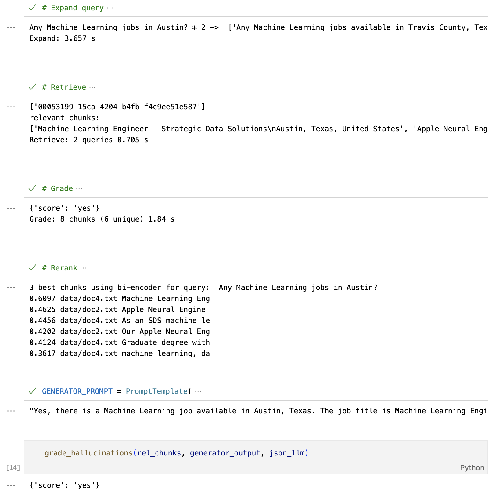

# Sample RAG for document search

- **Query expansion**
- **VectorDB retrieval**
- **Bi-Encoder grading**
- **Re-ranking**
- **Hallucination Check**

### Other possible enhancements

🟢 Simplest
- Better Parsers
- Chunk size experiments for optimal Chunk Size.Avg Response Time, Avg Faithfulness, Avg Relevancy
- Hybrid Search - vector search + keyword search
- Metadata Filters

🟡 Advanced Retrieval
- ✅ Reranking - select top N docs from retriever
- Recursive Retrieval 
- Embedded Tables
- Small-to-big Retrieval

🔴 Fine-tuning
- Embedding fine-tuning
- LLM fine-tuning

⚫️ Agentic Behavior
- Routing - choose DB based on metadata
- Query Planning - Ben went to which school in Aug 1954? -> What was Ben's education history? 
- Multi-document Agents
- More Expressive
- Harder to Implement Higher Latency/Cost

# Example
